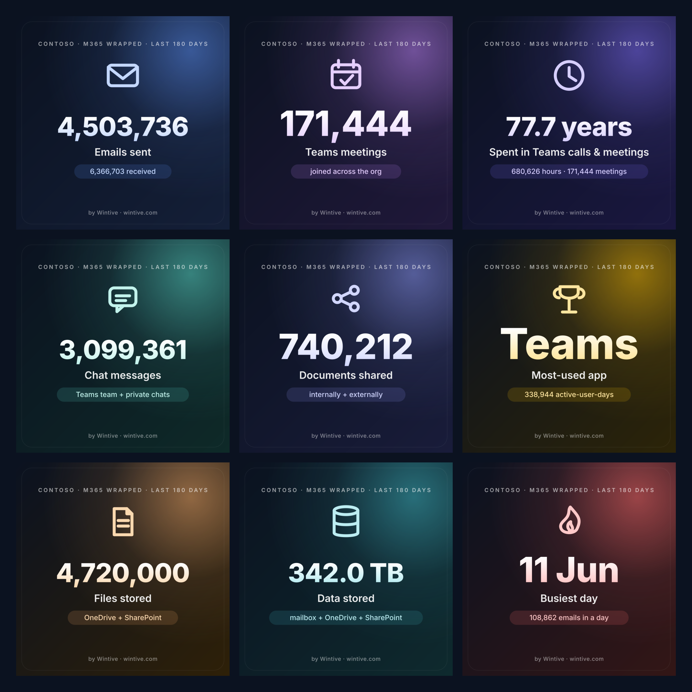

<h1 align="center">🎁 M365 Wrapped</h1>

<p align="center">
  <b>Spotify Wrapped, but for your Microsoft 365 tenant.</b><br>
  Point it at your tenant → get beautiful, shareable stat cards.
</p>

<p align="center">
  
  
  
  
</p>

<p align="center">
  
</p>

---

Nine stats — emails, Teams meeting-hours, chat, documents shared, most-used app, files, storage,
busiest day — as **one shareable 3×3 image** plus the individual square PNG cards.
Drop them on LinkedIn, in a Teams channel, or a client QBR deck. It reads **only** Microsoft 365 usage
reports, so it's safe to run and easy to approve.

> **Read-only.** One Graph permission (`Reports.Read.All`). **Org-aggregate only** — no individual
> user is ever singled out. Nothing leaves your machine.

## Try it in 10 seconds (no Azure, no login)

```bash
git clone https://github.com/wintive/m365-wrapped && cd m365-wrapped
docker compose run --rm wrapped demo     # synthetic tenant → ./out/cards/*.png + index.html
```

That renders the full card set from a built-in demo tenant so you can see the output first. For your
**own** numbers, just run it and sign in — **no app registration needed**:

```bash
docker compose run --rm wrapped run      # prints a device code → sign in → your tenant → ./out
```

It uses a built-in multi-tenant sign-in (read-only `Reports.Read.All`); a Global Admin approves it
once per tenant. Prefer your own app / headless automation? See **[docs/SETUP.md](docs/SETUP.md)**.

<details>
<summary>…without Docker</summary>

Cards render via <b>rsvg-convert</b> (librsvg) — no headless browser. Install it once:
`apt-get install librsvg2-bin` (Debian/Ubuntu) or `brew install librsvg` (macOS).

```bash
pip install .
m365-wrapped demo --out ./out            # or: m365-wrapped run --period D180 --out ./out
```
</details>

## What you get (`./out/`)

| File | What |
|------|------|
| `grid.png` | **the 3×3** — all 9 cards on one image |
| `cards/*.png` | one 1080×1080 card per stat, if you'd rather post a single number |
| `index.html` | a recap page of every card |
| `stats.json` | the raw numbers |

**Cards in v0.1:** ✉️ emails sent/received · 📅 Teams meetings & chat · ⏱️ time in meetings (*"77 years!"*) ·
🏆 most-used app · 📁 total storage · 🔥 busiest day · 🧑‍💻 people active.

## Auth

Two ways, and the tool picks automatically — full guide in **[docs/SETUP.md](docs/SETUP.md)**:
- **Device-code sign-in (default)** — just run it and sign in; **no app registration** (a Global Admin
  approves the read-only `Reports.Read.All` scope once per tenant).
- **App-only** (client secret or certificate) — for headless / scheduled runs.

Every stat maps to a documented Graph endpoint in **[docs/METRICS.md](docs/METRICS.md)**; the privacy
stance is in **[docs/PRIVACY.md](docs/PRIVACY.md)**.

## Good to know

- **Time window:** Microsoft Graph usage reports go back **180 days max**, so v0.1 wraps the last
  `D180` (`--period D7|D30|D90|D180`). A true rolling 12-month recap (via monthly snapshots) is on the
  roadmap.
- **MSP mode:** run it per client and co-brand the cards (`brand_logo`) for a QBR artifact.
- **Anonymize:** `--anonymize` relabels the tenant; cards are org-aggregate either way.

## Roadmap

- [ ] Meeting **hours** (not just counts)
- [ ] True 12-month recap via a snapshot accumulator
- [ ] More cards: file counts, active-user growth, per-app breakdown
- [ ] Prebuilt image on GHCR

## Contributing

PRs welcome — new card ideas especially. `pip install .[dev]` then `ruff check . && pytest`.

## About Wintive

M365 Wrapped is a free, deliberately off-topic side project by **[Wintive](https://www.wintive.com)** —
we run fixed-scope **Microsoft 365 security audits** and **managed services** for US SMBs
(HIPAA · SOC 2 · CMMC). This tool touches none of that; it's pure read-only usage fun. If it made you
smile, come say hi. 🎁

---

<p align="center">Built by <a href="https://www.wintive.com">Wintive</a> · MIT licensed</p>
